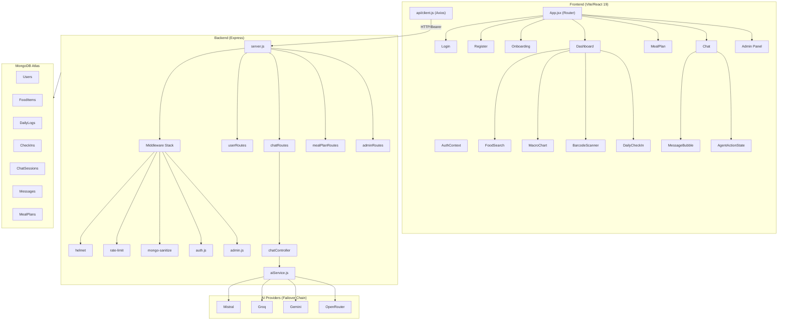

# Antigravity Nutrition — Full Codebase Architecture

> **Scan Date:** May 18, 2026 | **Stack:** MERN (Vite/React 19 + Node/Express + MongoDB Atlas) | **Deployment:** Vercel (multi-service)

---

## 1. Project Structure

```
nutri_guide_app/
├── index.html                   # SPA entry (SEO tags, Google Fonts, Material Icons)
├── package.json                 # Frontend deps + concurrently dev scripts
├── vercel.json                  # Multi-service deploy config
├── vite.config.js               # Vite build settings
│
├── src/                         # ───── FRONTEND (React 19 + Tailwind v4) ─────
│   ├── main.jsx                 # React DOM root
│   ├── App.jsx                  # Router: public /, /login, /register + protected routes
│   ├── App.css                  # Legacy Vite scaffold CSS (unused by app)
│   ├── index.css                # Tailwind v4 theme + custom component classes
│   │
│   ├── api/
│   │   └── client.js            # Axios instance (env detection, token interceptor, 401 redirect)
│   │
│   ├── context/
│   │   └── AuthContext.jsx      # Global auth state (token, user, login/logout, verify-on-mount)
│   │
│   ├── utils/
│   │   └── validatePassword.js  # Client-side 12-char complexity validator
│   │
│   ├── pages/
│   │   ├── Login.jsx            # Split-screen login w/ hero image, Framer Motion
│   │   ├── Register.jsx         # Split-screen register w/ password strength check
│   │   ├── Onboarding.jsx       # Post-registration profile setup wizard
│   │   ├── Dashboard.jsx        # Main hub: food logging, macro chart, check-in, streaks
│   │   ├── MealPlan.jsx         # 7-day AI plan viewer, PDF export, food swap (AI + manual)
│   │   └── Chat.jsx             # Agentic AI coach w/ tool execution loop, image upload
│   │
│   └── components/
│       ├── FoodSearch.jsx        # Debounced food DB search + custom food entry form
│       ├── MacroChart.jsx        # Recharts RadialBarChart (responsive)
│       ├── BarcodeScanner.jsx    # html5-qrcode camera/file scanner → food lookup
│       ├── DailyCheckIn.jsx      # Mood/energy/satiety sliders → POST /api/checkin
│       ├── AchievementToast.jsx  # Animated Framer Motion toast (streak milestones)
│       ├── auth/
│       │   ├── ProtectedRoute.jsx  # Token-gated wrapper → redirects to /login
│       │   └── AdminRoute.jsx      # Token + role=admin gate → redirects to /login
│       └── chat/
│           ├── MessageBubble.jsx   # ReactMarkdown w/ GFM, sanitization, feedback thumbs
│           └── AgentActionState.jsx # Tool execution UX (pulsing icon, expandable result)
│
├── backend/                     # ───── BACKEND (Node 20 + Express) ─────
│   ├── package.json             # Backend deps (express, mongoose, AI SDKs, etc.)
│   ├── server.js                # App entry: CORS, helmet, rate-limit, mongo-sanitize, static
│   │
│   ├── config/
│   │   └── db.js                # Mongoose connection w/ options
│   │
│   ├── middleware/
│   │   ├── auth.js              # JWT verify → req.user (checks isDisabled)
│   │   ├── admin.js             # role === 'admin' gate (403 otherwise)
│   │   └── csvUpload.js         # Multer memory + csv-parser stream middleware
│   │
│   ├── models/
│   │   ├── User.js              # email, password(bcrypt 12), role, age, weight, height, etc.
│   │   ├── FoodItem.js          # name, country, calories, protein, carbs, fats, fiber, etc.
│   │   ├── DailyLog.js          # userId, date, foodItems[{foodId, servings}]
│   │   ├── CheckIn.js           # userId, date, mood, energyLevel, satiety
│   │   ├── ChatSession.js       # user, isActive, title
│   │   ├── Message.js           # session, role, content, toolCalls, feedback, imageUrl
│   │   └── MealPlan.js          # user, days[{date, meals{B/L/D/S}, totalCalories}]
│   │
│   ├── controllers/
│   │   ├── userController.js    # register, login, getProfile, updateProfile
│   │   ├── chatController.js    # createOrGetSession, sendMessage, executeTool, submitFeedback
│   │   ├── mealPlanController.js # generate(TDEE), save, getCurrent, suggestReplacement, commit
│   │   └── adminController.js   # Full CRUD: users, food, chat sessions, meal plans, CSV import
│   │
│   ├── routes/
│   │   ├── userRoutes.js
│   │   ├── chatRoutes.js
│   │   ├── mealPlanRoutes.js
│   │   └── adminRoutes.js       # All behind protect + admin middleware
│   │
│   ├── services/
│   │   └── aiService.js         # Multi-provider failover: Mistral → Groq → Gemini → OpenRouter
│   │
│   ├── utils/
│   │   ├── generateToken.js     # JWT sign (30d expiry)
│   │   ├── validatePassword.js  # Server-side 12-char complexity validator (mirrors frontend)
│   │   └── csvFoodParser.js     # Row parser, bulk validator, escapeRegex, paginate helper
│   │
│   └── scripts/
│       ├── createAdmin.js       # npm run create-admin bootstrap
│       └── dbJanitor.js         # Data integrity maintenance
```

---

## 2. Architecture Diagram



---

## 3. API Route Map

### User Routes — `/api/users`
| Method | Endpoint | Auth | Description |
|--------|----------|------|-------------|
| POST | `/register` | — | Create account (validates password server-side) |
| POST | `/login` | — | Returns JWT + user object |
| GET | `/profile` | `protect` | Get current user (token verification) |
| PUT | `/profile` | `protect` | Update profile (age, weight, height, etc.) |

### Chat Routes — `/api/chat`
| Method | Endpoint | Auth | Description |
|--------|----------|------|-------------|
| POST | `/session` | `protect` | Create or retrieve active session |
| GET | `/session/:sessionId/messages` | `protect` | Paginated message history |
| POST | `/message` | `protect` | Send user message → AI completion (+ tool calls) |
| POST | `/execute-tool` | `protect` | Execute AI tool call (validated against stored IDs) |
| POST | `/feedback/:messageId` | `protect` | Submit thumbs up/down feedback |

### Meal Plan Routes — `/api/meal-plan`
| Method | Endpoint | Auth | Description |
|--------|----------|------|-------------|
| POST | `/generate` | `protect` | AI-generate 7-day plan (uses TDEE + logs + chat prefs) |
| POST | `/save` | `protect` | Persist draft plan to DB |
| GET | `/current` | `protect` | Retrieve saved plan + target calories |
| POST | `/suggest-replacement` | `protect` | AI food swap suggestion |
| POST | `/commit-replacement` | `protect` | Persist a food swap to a saved plan |

### Admin Routes — `/api/admin` (all require `protect` + `admin`)
| Method | Endpoint | Description |
|--------|----------|-------------|
| GET | `/stats` | Dashboard stats (users, logs, sessions, 30d registrations) |
| GET/PATCH/DELETE | `/users/:id` | User CRUD (cascade delete clears all related data) |
| GET | `/users/:id/logs` | Paginated food logs for a user |
| GET | `/users/:id/checkins` | Paginated check-ins for a user |
| GET/POST/PUT/DELETE | `/food/:id` | Food item CRUD |
| POST | `/food/import` | CSV bulk import (multer + csv-parser, 500-chunk batches) |
| GET/PATCH/DELETE | `/chat/sessions/:sessionId` | Session management |
| GET | `/chat/sessions/:sessionId/messages` | View session messages |
| DELETE | `/chat/messages/:messageId` | Delete individual message |
| GET/DELETE | `/meal-plans/:id` | Meal plan management |

---

## 4. AI Agentic Architecture

### Multi-Provider Failover (`aiService.js`)
```
Request → Mistral → (429/503?) → Groq → (429/503?) → Gemini → (429/503?) → OpenRouter
```
- Each provider implements the OpenAI-compatible chat completion format
- Tool definitions (`search_food_database`, `get_user_food_logs`) are injected for chat
- Meal plan generation uses a separate JSON-only prompt (no tools)

### Tool Execution Loop (`chatController.js` + `Chat.jsx`)
1. User sends message → backend builds system prompt (user profile, recent logs)
2. AI responds with optional `tool_calls`
3. Frontend detects tool calls → displays `AgentActionState` → POSTs `/execute-tool`
4. Backend validates tool call ID, runs query, returns result
5. Frontend re-sends with tool result → AI provides final response
6. Loop continues (`while` on frontend) until no more tool calls

### Available Agent Tools
| Tool | Description |
|------|-------------|
| `search_food_database` | Text search on FoodItem collection (fuzzy name matching) |
| `get_user_food_logs` | Retrieve user's recent daily food logs with macro totals |

---

## 5. Security Model

| Layer | Implementation |
|-------|---------------|
| **Transport** | HTTPS (Vercel-managed) |
| **Headers** | `helmet()` (CSP, HSTS, etc.) |
| **Rate Limiting** | `express-rate-limit` (100 req/15min default) |
| **NoSQL Injection** | Custom `mongo-sanitize` middleware strips `$` and `.` from body/query/params |
| **Auth** | JWT (30d expiry), `bcryptjs` cost factor 12 |
| **Password Policy** | 12+ chars, upper/lower/digit/symbol (validated both client + server) |
| **Account Control** | `isDisabled` flag checked on every authenticated request |
| **Admin Safeguard** | Cannot delete last admin, cannot disable self |
| **Tool Execution** | Tool call IDs verified against stored message records |

---

## 6. Data Models (MongoDB Schemas)

| Model | Key Fields | Indexes |
|-------|-----------|---------|
| **User** | email (unique), password, role, age, weight, height, healthGoals, restrictions, location, isDisabled, streak | — |
| **FoodItem** | name, country, calories, protein, carbs, fats, fiber, sugar, sodium | text index on `name` |
| **DailyLog** | userId, date, foodItems[{foodId, servings}] | compound: userId + date |
| **CheckIn** | userId, date, mood, energyLevel, satiety | — |
| **ChatSession** | user, isActive, title | — |
| **Message** | session, role, content, toolCalls, toolCallId, toolResult, feedback, imageUrl | — |
| **MealPlan** | user, days[{date, meals{Breakfast/Lunch/Dinner/Snacks}, totalCalories}] | — |

---

## 7. Frontend Design System

### Theme (Tailwind v4 CSS Variables in `index.css`)
| Token | Value | Usage |
|-------|-------|-------|
| `--color-primary` | `#3a6937` | Buttons, accents, brand identity |
| `--color-primary-dark` | `#2d5229` | Hover states |
| `--color-primary-container` | `#d4edda` | Light backgrounds, badges |
| `--color-surface-off-white` | `#f8faf7` | Page backgrounds |
| `--color-text-rich-black` | `#1a1a1a` | Headings, primary text |
| `--color-on-surface-variant` | `#7c7c7c` | Secondary text, labels |

### Custom Utility Classes
- `.kcal-input` — Styled form inputs with focus ring
- `.kcal-btn-primary` — Primary action button
- `.kcal-slider` / `.kcal-slider-coral` — Range input styling
- `.kcal-nav-item` — Bottom nav button
- `.glass-panel` — Card container with subtle shadow
- `.custom-scrollbar` — Styled scrollbar

### Typography
- **Headlines:** Outfit (Google Fonts)
- **Body:** Inter (Google Fonts)
- **Icons:** Material Symbols Outlined + Lucide React

---

## 8. Key Dependencies

### Frontend
| Package | Version | Purpose |
|---------|---------|---------|
| react | 19.x | UI framework |
| react-router-dom | 7.x | Client-side routing |
| axios | ^1.9 | HTTP client |
| framer-motion | ^12.x | Animations |
| recharts | ^2.x | Data visualization (MacroChart) |
| react-markdown | ^10.x | AI message rendering |
| remark-gfm | ^4.x | GitHub Flavored Markdown |
| rehype-sanitize | ^6.x | HTML sanitization |
| html5-qrcode | ^2.x | Barcode scanning |
| jspdf + jspdf-autotable | — | PDF export |
| @tailwindcss/vite | ^4.x | Tailwind CSS v4 |

### Backend
| Package | Version | Purpose |
|---------|---------|---------|
| express | ^5.x | Web framework |
| mongoose | ^8.x | MongoDB ODM |
| jsonwebtoken | ^9.x | JWT auth |
| bcryptjs | ^3.x | Password hashing |
| helmet | ^8.x | Security headers |
| express-rate-limit | ^7.x | Rate limiting |
| @mistralai/mistralai | — | Primary AI provider |
| groq-sdk | — | Fallback AI provider |
| @google/generative-ai | — | Fallback AI provider |
| openai | ^4.x | OpenRouter client |
| multer | ^2.x | File uploads (CSV) |
| csv-parser | ^3.x | CSV stream parsing |

---

## 9. Environment Variables

### Required
| Variable | Description |
|----------|-------------|
| `MONGO_URI` | MongoDB Atlas connection string |
| `JWT_SECRET` | JWT signing secret |
| `MISTRAL_API_KEY` | Primary AI provider key |
| `FRONTEND_URL` | CORS origin (e.g. `https://app.vercel.app`) |
| `PORT` | Backend port (default: 5000) |

### Optional (AI Failover)
| Variable | Description |
|----------|-------------|
| `GROQ_API_KEY` | Groq Cloud API key |
| `GEMINI_API_KEY` | Google Gemini API key |
| `OPENROUTER_API_KEY` | OpenRouter API key |

---

## 10. Deployment Configuration (`vercel.json`)

```json
{
  "buildCommand": "npm run build",
  "outputDirectory": "dist",
  "rewrites": [
    { "source": "/_/backend/:path*", "destination": "https://backend-url/:path*" },
    { "source": "/(.*)", "destination": "/index.html" }
  ]
}
```

- Frontend static assets served from `dist/`
- Backend API proxied via `/_/backend` prefix
- SPA fallback for client-side routing
