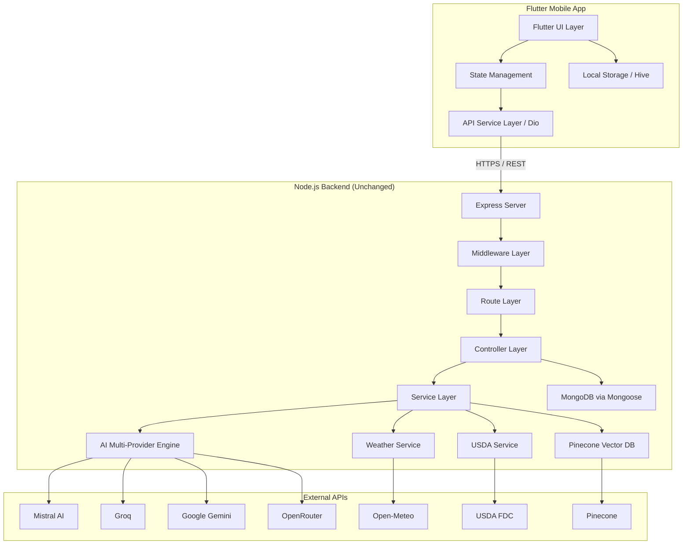
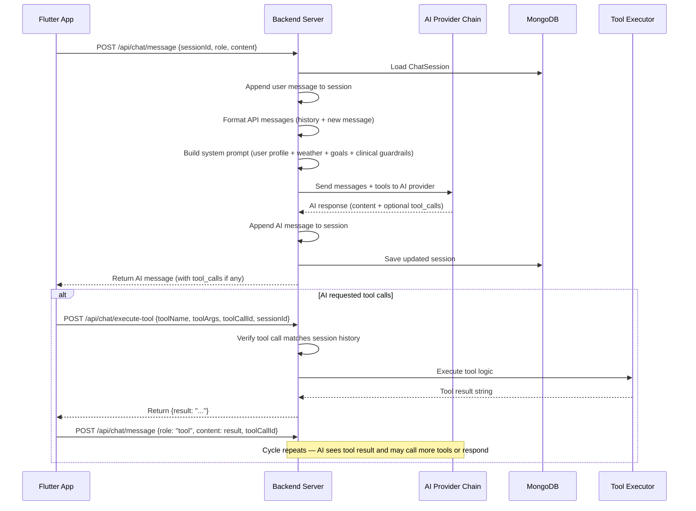
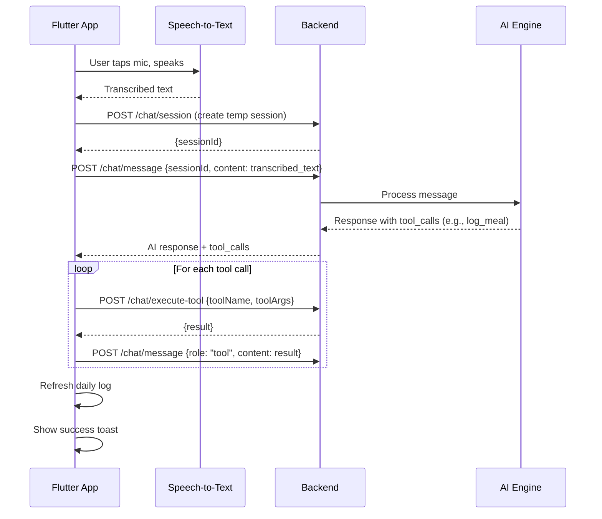

# Mezan Nutrition AI — Flutter Replication
# Software Requirements Specification (SRS) & Product Requirements Document (PRD)

> **Source Project**: `nutri_guide_app` — React 19 + Vite + TailwindCSS 4 (Frontend) / Node.js + Express 5 + MongoDB + Multi-AI (Backend)
> **Target Platform**: Flutter Mobile Application
> **Document Version**: 1.0
> **Date**: 2026-05-30

---

## Table of Contents

1. [Executive Summary](#1-executive-summary)
2. [Current Technology Stack](#2-current-technology-stack)
3. [System Architecture Overview](#3-system-architecture-overview)
4. [Data Models (MongoDB Schemas)](#4-data-models-mongodb-schemas)
5. [Backend API — Complete Route Reference](#5-backend-api--complete-route-reference)
6. [AI Engine — Architecture & Control Flows](#6-ai-engine--architecture--control-flows)
7. [Frontend — Screen-by-Screen Specification](#7-frontend--screen-by-screen-specification)
8. [Component Library — Reusable Widgets](#8-component-library--reusable-widgets)
9. [Authentication & Security](#9-authentication--security)
10. [External Service Integrations](#10-external-service-integrations)
11. [Admin Panel](#11-admin-panel)
12. [Non-Functional Requirements](#12-non-functional-requirements)
13. [Flutter Technology Mapping](#13-flutter-technology-mapping)
14. [Follow-Up Questions](#14-follow-up-questions)

---

## 1. Executive Summary

### 1.1 Product Name
**Mezan Nutrition AI** — An AI-powered clinical nutrition assistant and food diary app.

### 1.2 Product Vision
Mezan is a full-stack nutrition tracking platform with an AI chatbot named **"Nova"** that acts as a personal clinical nutritionist. Users can:
- Track daily food intake (manual search, voice input, barcode scanning)
- Chat with an AI nutritionist that can log meals, search food databases, generate meal plans, and provide clinically-sound nutrition advice
- Generate AI-powered 7-day meal plans adapted to local weather, user pantry, and health goals
- View progress through interactive concentric ring charts and weekly trend visualizations
- Manage a personal pantry inventory
- Receive daily check-in prompts (mood, energy, satiety)
- Export PDF reports of nutrition data

### 1.3 Target Users
- Health-conscious individuals tracking nutrition
- People with specific dietary goals (weight loss, muscle gain, maintenance)
- Users with dietary restrictions (Vegan, Halal, Gluten-Free, etc.)
- Users in UAE/South Asian regions (location-aware food suggestions)

### 1.4 Scope of Flutter Replication
The Flutter app will replicate **all** existing functionality from the React web app, connecting to the **same Node.js backend**. The backend remains unchanged — only the frontend is rewritten in Flutter/Dart.

---

## 2. Current Technology Stack

### 2.1 Frontend (React — to be replaced with Flutter)

| Technology | Version | Purpose |
|---|---|---|
| React | 19.2.6 | UI framework |
| React Router DOM | 7.15.0 | Client-side routing |
| Vite | 8.0.12 | Build tool / dev server |
| TailwindCSS | 4.3.0 | Utility-first CSS framework |
| Framer Motion | 12.38.0 | Animations & transitions |
| Axios | 1.16.1 | HTTP client |
| Recharts | 3.8.1 | Charts and data visualization |
| Lucide React | 1.16.0 | Icon library |
| html5-qrcode | 2.3.8 | Barcode/QR scanner |
| React Markdown | 10.1.0 | Markdown rendering in chat |
| jsPDF + jsPDF-AutoTable | 4.2.1 / 5.0.7 | PDF export |
| Web Speech API (browser) | N/A | Voice input / speech recognition |

### 2.2 Backend (Node.js — remains unchanged)

| Technology | Version | Purpose |
|---|---|---|
| Express | 4.21.2 | HTTP server framework |
| Mongoose | 9.6.3 | MongoDB ODM |
| JWT (jsonwebtoken) | 9.0.3 | Token-based authentication |
| bcryptjs | 3.0.3 | Password hashing |
| Helmet | 8.1.0 | HTTP security headers |
| express-rate-limit | 8.5.2 | Rate limiting |
| Nodemailer | 8.0.7 | Email (password reset) |
| Multer | 2.1.1 | File uploads (CSV, PDF) |
| csv-parser | 3.2.1 | CSV parsing |
| pdf-parse | 1.1.1 | PDF text extraction |
| Zod | 4.4.3 | Schema validation |

### 2.3 AI Providers (Multi-Provider Fallback Chain)

| Provider | SDK | Model | Priority |
|---|---|---|---|
| Mistral AI | `@mistralai/mistralai` 2.2.1 | `mistral-small-latest` | 1st (Primary) |
| Groq | `groq-sdk` 1.2.0 | `llama-3.3-70b-versatile` | 2nd |
| Google Gemini | `@google/generative-ai` 0.24.1 | `gemini-1.5-flash` | 3rd |
| OpenRouter | `openai` 6.37.0 (custom baseURL) | `google/gemini-2.0-flash-001` | 4th (also handles vision/images) |

### 2.4 External APIs

| API | Purpose |
|---|---|
| USDA FoodData Central | Verified nutrition lookup (per-food macros) |
| Open-Meteo Geocoding API | Location → lat/lon conversion |
| Open-Meteo Forecast API | Real-time weather + 7-day forecast |
| Pinecone (Vector DB) | Knowledge base semantic search (nutrition PDFs) |

### 2.5 Database
- **MongoDB Atlas** (cloud-hosted)
- 6 collections: `users`, `fooditems`, `dailylogs`, `checkins`, `chatsessions`, `mealplans`

---

## 3. System Architecture Overview



### 3.1 Request Flow (General)
1. Flutter app makes HTTP request to backend via Dio/http
2. Request passes through CORS → Helmet → Rate Limiter → Mongo Sanitizer
3. Protected routes pass through JWT `protect` middleware (verifies token, loads user from cache/DB)
4. Admin routes additionally pass through `admin` middleware (checks `user.role === 'admin'`)
5. Controller processes business logic, calls services if needed
6. Response returned to Flutter app as JSON

---

## 4. Data Models (MongoDB Schemas)

### 4.1 User Model

```
Collection: users
```

| Field | Type | Default | Constraints | Notes |
|---|---|---|---|---|
| `_id` | ObjectId | auto | primary key | |
| `email` | String | required | unique, lowercase, trimmed | Login identifier |
| `password` | String | required | — | bcrypt hashed (salt 10) |
| `name` | String | `'User'` | — | Display name |
| `age` | Number | `null` | — | Years |
| `weight` | Number | `null` | — | Kilograms |
| `height` | Number | `null` | — | Centimeters |
| `healthGoals` | String | `'Maintenance'` | enum: `Weight Loss`, `Muscle Gain`, `Maintenance` | |
| `restrictions` | [String] | `[]` | — | e.g. `['Vegan', 'Halal']` |
| `location` | String | `'UAE'` | — | City/Country for weather & food localization |
| `streakCount` | Number | `0` | — | Consecutive days with food logs |
| `role` | String | `'user'` | enum: `user`, `admin` | |
| `isDisabled` | Boolean | `false` | — | Admin can disable accounts |
| `pantry` | [String] | `[]` | — | Items user has at home |
| `targetCalories` | Number | `2000` | — | Daily calorie goal |
| `createdAt` | Date | auto | — | Mongoose timestamp |
| `updatedAt` | Date | auto | — | Mongoose timestamp |

**Pre-save hook**: Password is automatically hashed with bcrypt (salt rounds: 10) before saving if modified.

**Instance method**: `matchPassword(enteredPassword)` — compares entered password against stored hash.

---

### 4.2 FoodItem Model

```
Collection: fooditems
```

| Field | Type | Default | Constraints |
|---|---|---|---|
| `_id` | ObjectId | auto | primary key |
| `name` | String | required | trimmed, text-indexed |
| `country` | String | `'Global'` | indexed, trimmed |
| `calories` | Number | required | — |
| `protein` | Number | `0` | — |
| `carbs` | Number | `0` | — |
| `fats` | Number | `0` | — |
| `fiber` | Number | `0` | — |
| `sugar` | Number | `0` | — |
| `sodium` | Number | `0` | — |
| `vitamin_A` | Number | `0` | — |
| `vitamin_C` | Number | `0` | — |
| `fdcId` | Number | `null` | USDA FDC identifier |
| `usdaOfficialName` | String | `null` | — |
| `verifiedWithUSDA` | Boolean | `false` | — |
| `barcode` | String | `null` | For barcode scanning |
| `category` | String | `null` | Food category |

**Indexes**: Text index on `name`, Standard index on `country`

---

### 4.3 DailyLog Model

```
Collection: dailylogs
```

| Field | Type | Default | Notes |
|---|---|---|---|
| `_id` | ObjectId | auto | primary key |
| `userId` | String | required | indexed |
| `date` | String | required | ISO 8601 string (UTC midnight) |
| `foodItems` | Array | `[]` | Embedded food items (see below) |
| `totals.calories` | Number | `0` | Sum of all items × servings |
| `totals.protein` | Number | `0` | |
| `totals.carbs` | Number | `0` | |
| `totals.fats` | Number | `0` | |

**Embedded Food Item sub-schema**:

| Field | Type | Default |
|---|---|---|
| `foodId` | String | `null` |
| `name` | String | required |
| `calories` | Number | `0` |
| `protein` | Number | `0` |
| `carbs` | Number | `0` |
| `fats` | Number | `0` |
| `servings` | Number | `1` |

**Compound Index**: `{ userId: 1, date: 1 }`

**Key Logic**: When creating a daily log, if a log already exists for the same user + date, the new food items are **appended** (not replaced) and totals are **incremented**.

---

### 4.4 CheckIn Model

```
Collection: checkins
```

| Field | Type | Default | Constraints |
|---|---|---|---|
| `_id` | ObjectId | auto | primary key |
| `userId` | String | required | indexed |
| `date` | String | required | ISO 8601 |
| `mood` | String | undefined | Free text |
| `energyLevel` | Number | undefined | min: 1, max: 10 |
| `satiety` | Number | undefined | min: 1, max: 10 |

**Compound Index**: `{ userId: 1, date: 1 }`

---

### 4.5 ChatSession Model

```
Collection: chatsessions
```

| Field | Type | Default | Notes |
|---|---|---|---|
| `_id` | ObjectId | auto | primary key |
| `userId` | String | required | indexed |
| `title` | String | `'New Conversation'` | Auto-set from first user message (first 30 chars) |
| `isActive` | Boolean | `true` | Admin can close sessions |
| `messages` | Array | `[]` | Embedded Message sub-documents |

**Embedded Message sub-schema**:

| Field | Type | Default | Notes |
|---|---|---|---|
| `_id` | String | crypto random hex | Custom string ID |
| `role` | String | required | enum: `user`, `assistant`, `system`, `tool` |
| `content` | String | `''` | Message text / markdown |
| `toolCalls` | Mixed | undefined | Array of tool call objects from AI |
| `toolCallId` | String | undefined | For `tool` role messages |
| `name` | String | undefined | Tool function name (for `tool` role) |
| `feedback` | String | `null` | enum: `up`, `down`, `null` |
| `imageUrl` | String | undefined | Base64 data URL for image messages |
| `createdAt` | String | `new Date().toISOString()` | |

---

### 4.6 MealPlan Model

```
Collection: mealplans
```

| Field | Type | Default | Notes |
|---|---|---|---|
| `_id` | ObjectId | auto | primary key |
| `userId` | String | required | **unique** — one plan per user |
| `days` | Array | `[]` | Array of DailyPlan sub-documents |

**DailyPlan sub-schema**:

| Field | Type | Notes |
|---|---|---|
| `date` | String | `YYYY-MM-DD` |
| `totalCalories` | Number | Sum of all meal items |
| `meals.Breakfast` | Array of MealItem | |
| `meals.Lunch` | Array of MealItem | |
| `meals.Dinner` | Array of MealItem | |
| `meals.Snacks` | Array of MealItem | |

**MealItem sub-schema**:

| Field | Type | Default |
|---|---|---|
| `foodName` | String | required |
| `calories` | Number | `0` |
| `protein` | Number | `0` |
| `carbs` | Number | `0` |
| `fats` | Number | `0` |
| `status` | String | `'active'` (enum: `active`, `replaced`) |

---

## 5. Backend API — Complete Route Reference

### 5.1 Authentication & User Routes (`/api/users`)

| Method | Endpoint | Auth | Controller | Description |
|---|---|---|---|---|
| `POST` | `/api/users/register` | Public | `registerUser` | Create new account. Returns user object + JWT token. |
| `POST` | `/api/users/login` | Public | `authUser` | Authenticate with email + password. Supports `rememberMe` flag. Returns full user profile + JWT token. Checks `isDisabled`. |
| `GET` | `/api/users/profile` | Protected | `getUserProfile` | Fetch current user's profile. Triggers background streak recalculation. |
| `PUT` | `/api/users/profile` | Protected | `updateUserProfile` | Update profile fields: `name`, `age`, `weight`, `height`, `healthGoals`, `restrictions`, `location`, `pantry`, `targetCalories`. Invalidates user cache. |

**Rate Limiting**: Auth routes have a strict limiter of **20 requests per 15 minutes**.

---

### 5.2 Food Routes (`/api/food`)

| Method | Endpoint | Auth | Controller | Description |
|---|---|---|---|---|
| `GET` | `/api/food/search?q=&country=` | Protected | `searchFood` | Searches local food database (in-memory cache) + USDA FoodData Central API concurrently. Merges results, deduplicates, returns max 40 items. |

**Search Logic**:
1. Loads all local foods from in-memory cache (populated from MongoDB `fooditems` collection)
2. Simultaneously queries USDA FDC API for up to 25 results
3. Filters local foods by `country` and `q` (keyword matching)
4. Merges, deduplicating by `fdcId` or exact name match
5. Returns top 40 results

---

### 5.3 Daily Log Routes (`/api/logs`)

| Method | Endpoint | Auth | Controller | Description |
|---|---|---|---|---|
| `POST` | `/api/logs/daily` | Protected | `createDailyLog` | Create or append to daily food log. Body: `{ date, foodItems[] }`. Recalculates totals. Triggers background streak update. |
| `GET` | `/api/logs/daily/:date` | Protected | `getDailyLog` | Get food log for a specific date. Returns `{ totals, foodItems }`. |
| `GET` | `/api/logs/weekly?startDate=&endDate=` | Protected | `getWeeklyLogs` | Get logs for a date range. Defaults to last 7 days. |

**createDailyLog Control Flow**:
1. Parse and normalize date to UTC midnight
2. Validate `foodItems` array
3. For each food item:
   - If `foodId` provided → look up in cached foods for verified macros
   - If not found but `name` provided → use provided macros (fallback for USDA/AI-logged items)
4. Find existing log for same user + date:
   - **Exists**: Append new food items, increment totals
   - **Doesn't exist**: Create new log document
5. Background: recalculate user's streak count

---

### 5.4 Check-In Routes (`/api/checkin`)

| Method | Endpoint | Auth | Controller | Description |
|---|---|---|---|---|
| `POST` | `/api/checkin` | Protected | `createCheckIn` | Create/update daily check-in. Body: `{ date, mood, energyLevel (1-10), satiety (1-10) }`. Upserts — one check-in per user per day. |

---

### 5.5 Chat Routes (`/api/chat`)

| Method | Endpoint | Auth | Controller | Description |
|---|---|---|---|---|
| `POST` | `/api/chat/session` | Protected | `createOrGetSession` | Create a new chat session or retrieve existing one by `sessionId`. |
| `GET` | `/api/chat/session/:sessionId/messages` | Protected | `getSessionMessages` | Get all messages for a session. |
| `POST` | `/api/chat/message` | Protected | `sendMessage` | Send a user message and get AI response. The core chat endpoint. |
| `POST` | `/api/chat/execute-tool` | Protected | `executeTool` | Execute an AI-requested tool call (e.g., `log_meal`, `search_food_database`). |
| `POST` | `/api/chat/feedback/:messageId` | Protected | `submitFeedback` | Submit thumbs up/down feedback for a message. |

---

### 5.6 Meal Plan Routes (`/api/meal-plan`)

| Method | Endpoint | Auth | Controller | Description |
|---|---|---|---|---|
| `POST` | `/api/meal-plan/generate` | Protected | `generateMealPlan` | Generate a 7-day AI meal plan. Uses TDEE calculation, user profile, recent food logs, chat history, weather forecast, and pantry as context. Returns `{ draft, targetCalories }`. |
| `POST` | `/api/meal-plan/save` | Protected | `saveMealPlan` | Save/confirm a generated meal plan. Upserts — one plan per user. |
| `GET` | `/api/meal-plan/current` | Protected | `getCurrentMealPlan` | Get current meal plan. Auto-strips past days (rolling window). |
| `POST` | `/api/meal-plan/suggest-replacement` | Protected | `suggestReplacement` | AI suggests ONE replacement food with similar macros, available in user's location. |
| `POST` | `/api/meal-plan/commit-replacement` | Protected | `commitReplacement` | Commit a food replacement into the saved plan. Updates the specific food item at `[dayDate][mealType][foodIndex]`. |

---

### 5.7 Weather Routes (`/api/weather`)

| Method | Endpoint | Auth | Controller | Description |
|---|---|---|---|---|
| `GET` | `/api/weather?location=` | Protected | — | Returns current weather + 7-day forecast for a location. |

---

### 5.8 Admin Routes (`/api/admin`) — All require `admin` role

| Method | Endpoint | Description |
|---|---|---|
| `GET` | `/stats` | Dashboard statistics (total users, foods, logs, sessions, etc.) |
| `GET` | `/users` | Paginated user list with search |
| `GET` | `/users/:id` | Single user detail with summary counts |
| `PATCH` | `/users/:id` | Update user fields (disable, edit profile) |
| `DELETE` | `/users/:id` | Delete user + cascade delete all their data |
| `GET` | `/users/:id/logs` | Paginated food logs for a user |
| `GET` | `/users/:id/checkins` | Paginated check-ins for a user |
| `GET` | `/food` | Paginated food item list with search/filter |
| `POST` | `/food` | Create single food item |
| `PUT` | `/food/:id` | Update food item |
| `DELETE` | `/food/:id` | Delete food item |
| `POST` | `/food/import` | Bulk import food items from CSV file |
| `GET` | `/chat/sessions` | List all chat sessions (filterable by userId) |
| `GET` | `/chat/sessions/:sessionId/messages` | View messages in a session |
| `PATCH` | `/chat/sessions/:sessionId` | Update session (e.g., toggle `isActive`) |
| `DELETE` | `/chat/sessions/:sessionId` | Delete entire session |
| `DELETE` | `/chat/messages/:messageId` | Delete specific message |
| `GET` | `/meal-plans` | List all meal plans |
| `GET` | `/meal-plans/:id` | Get specific meal plan |
| `DELETE` | `/meal-plans/:id` | Delete meal plan |
| `POST` | `/knowledge-base/upload` | Upload PDF to Pinecone vector knowledge base |

**Admin Rate Limiting**: 60 requests per 15 minutes.

---

## 6. AI Engine — Architecture & Control Flows

### 6.1 Multi-Provider Fallback Chain

The AI service cycles through providers in order. On failure (429, 500, 503, 408 timeout), it automatically falls back to the next provider. Each provider has an **8-second timeout**.

```
Mistral (primary) → Groq → Gemini → OpenRouter
```

**Special routing**: If the user message contains an **image** (Base64 data URL), the request is routed directly to OpenRouter (Gemini 2.0 Flash — supports vision).

### 6.2 System Prompt Architecture

The AI system prompt is constructed dynamically for each request with:

1. **Persona**: "You are Nova — the expert AI clinical nutritionist for Mezan"
2. **User Profile**: Name, location, goal, age, weight, height, restrictions, date, time
3. **Clinical Daily Targets**: Calculated via Mifflin-St Jeor formula:
   - Calories: `user.targetCalories` (default 2000)
   - Protein: `25% of calories / 4` grams
   - Carbs: `45% of calories / 4` grams
   - Fats: `30% of calories / 9` grams
   - Water: `weight_kg × 35` ml
4. **Pantry List**: User's items at home
5. **Weather Context**: Current temp, humidity, conditions + weather-based dietary rules
6. **Clinical Safety & Drug-Nutrient Guardrails**: Extensive clinical rules covering:
   - Osteoporosis / Bisphosphonates
   - Liver Disease / NAFLD
   - Heart Failure / Statins / Digoxin
   - Warfarin / Anticoagulation
   - Chronic Kidney Disease (CKD)
   - Hypothyroidism / Levothyroxine
   - Iron Deficiency Anemia
   - Hypertension
   - Metformin / Type 2 Diabetes
7. **Tool Decision Tree**: Detailed rules for when to call which tools
8. **Response Format Rules**: Markdown tables for macros, progress summaries

### 6.3 AI Tool Definitions (15 tools)

#### Group 1 — Logging Tools

| Tool Name | Description | Required Params |
|---|---|---|
| `log_meal` | Log food/meal with macros | `name`, `calories`, `protein`, `carbs`, `fats` |
| `log_water_intake` | Log fluid intake | `amount_ml` |
| `log_exercise` | Log workout/activity | `activity`, `duration_min`, `intensity` |
| `log_body_metrics` | Log body measurements | — (all optional) |

#### Group 2 — Retrieval Tools

| Tool Name | Description | Required Params |
|---|---|---|
| `get_user_food_logs` | Get food diary for a date | — |
| `get_macro_history` | Fetch macro history for date range | `from`, `to` |
| `get_water_intake` | Get fluid intake for a day | — |
| `get_body_metrics_history` | Historical body measurements | `from` |
| `get_activity_logs` | Exercise history | — |
| `get_streak_and_achievements` | Streak count + badges | — |

#### Group 3 — Search & Lookup Tools

| Tool Name | Description | Required Params |
|---|---|---|
| `search_food_database` | Macro/micronutrient lookup | `query` |
| `search_restaurant_menu` | Restaurant menu nutrition | `restaurant` |
| `search_knowledge_base` | Pinecone KB semantic search | `query` |

#### Group 4 — Intelligence & Planning Tools

| Tool Name | Description | Required Params |
|---|---|---|
| `get_weather_forecast` | Real-time weather + forecast | — |
| `calculate_tdee` | Recalculate energy expenditure | `weight_kg`, `height_cm`, `age`, `activity_level`, `goal` |
| `generate_meal_plan` | Create 1-day or 7-day plan | `days` |
| `generate_shopping_list` | Shopping list from meal plan | — |
| `get_supplement_recommendations` | Micronutrient gap analysis | `analyze_from`, `analyze_to` |

### 6.4 Chat Message Flow — Complete Control Flow



### 6.5 Voice-to-Log Flow



### 6.6 Local NLP Fallback

When all AI providers fail, the backend has a local NLP fallback parser that:
1. Searches user text against a hardcoded `LOCAL_NUTRITION_DB` (12 common foods)
2. Detects food names, quantities (number words: "one", "two", etc.)
3. Handles water logging
4. Returns tool calls for `log_meal` or `log_water_intake`
5. Falls back to USDA API lookup for unrecognized foods

### 6.7 Food Lookup Chain (for `log_meal` tool)

```
1. Exact match in LOCAL_NUTRITION_DB (hardcoded 12 items)
   ↓ (miss)
2. Exact match in local MongoDB FoodItem cache
   ↓ (miss)
3. Keyword fuzzy match in local MongoDB FoodItem cache (with plural handling)
   ↓ (miss)
4. USDA FoodData Central API lookup
   ↓ (miss)
5. Return null → Error: "Could not verify food in database"
```

---

## 7. Frontend — Screen-by-Screen Specification

### 7.1 Login Page (`/login`)

**Components**: Email input, Password input, "Remember Me" checkbox, Login button, "Forgot Password?" link, Register link, Google Sign-In button (mock implementation)

**Design**: 
- Material 3 design language
- Glass-panel card centered on off-white background
- Brand logo ("Mezan" with spa icon) at top
- Green primary color (`#3A6937`) accent
- Animated transitions (Framer Motion → Flutter Hero/AnimatedSwitcher)

**Logic**:
- Calls `POST /api/users/login`
- Stores JWT token in local storage
- Redirects to `/dashboard` on success
- Shows error messages for invalid credentials
- Disabled accounts show specific error

---

### 7.2 Register Page (`/register`)

**Components**: Name input, Email input, Password input (with strength meter), Confirm Password, Register button, Login link

**Password Validation Rules**:
- Minimum 8 characters
- At least 1 uppercase letter
- At least 1 lowercase letter
- At least 1 number
- At least 1 special character

**Logic**:
- Calls `POST /api/users/register`
- Auto-logs in on success (stores token)
- Redirects to `/onboarding`

---

### 7.3 Forgot Password Page (`/forgot-password`)

**Components**: Email input, Security Question display, Answer input, New Password input, Submit button

**Flow**: Enter email → system shows security question → user answers → set new password

---

### 7.4 Reset Password Page (`/reset-password/:token`)

**Components**: Token-based reset form (linked from email)

---

### 7.5 Onboarding Page (`/onboarding`) — 4-Step Wizard

**Step 1 — About You**:
- Location (text input, placeholder: "City, Country")
- Age (number input)
- Weight in kg (number input)
- Height in cm (number input)
- "Continue" button (disabled until all fields filled)

**Step 2 — Your Goal**:
- Three selectable cards: `Weight Loss`, `Maintenance`, `Muscle Gain`
- Radio-style selection (green dot indicator)
- Back + Next buttons

**Step 3 — Dietary Preferences**:
- Chip/pill selection: `Vegan`, `Vegetarian`, `Gluten-Free`, `Dairy-Free`, `Nut Allergy`, `Halal`
- Multi-select toggle (green filled = selected)
- Back + Next buttons

**Step 4 — Security Recovery**:
- Custom security question (text input)
- Answer (text input)
- "Finalize Profile" button
- Calls `PUT /api/users/profile`
- Redirects to `/dashboard`

**Design**: Progress bar (4 segments), animated step transitions, glass-panel form card

---

### 7.6 Dashboard Page (`/dashboard`) — Main Home Screen

This is the richest screen in the app. It contains:

#### Top Section
- **TopAppBar**: Brand logo, weather widget (current temp + emoji), user avatar + name dropdown
- **Greeting**: Time-based ("Good Morning/Afternoon/Evening"), user's first name, "Here's your nutrition summary for today"

#### Concentric Progress Rings Section
- **5 nested concentric rings** showing daily progress:
  1. **Calories** (primary green) — value/goal
  2. **Protein** (data-protein color) — value/goal in grams
  3. **Carbs** (data-carbs color) — value/goal in grams
  4. **Fats** (data-fats color) — value/goal in grams
  5. **Water** (blue) — value/goal in ml
- Center displays "Remaining" calories
- **Streak Badge**: Shows current streak count with trending_up icon
- **Water Logger Controls**: "+250ml" and "+500ml" quick-add buttons (stored in localStorage per day)

#### Tab Navigation (5 tabs — horizontal scrollable chips)
1. **Trends** (`overview`): 7-day weekly trend chart (Recharts → fl_chart in Flutter) + Recent Meals list
2. **My Pantry** (`pantry`): PantryManager component — add/remove items from personal pantry
3. **Log Food** (`search`): Voice Input + manual Food Search database
4. **Barcode** (`scan`): Camera-based barcode scanner + image upload
5. **Check-in** (`checkin`): Mood, energy level, satiety daily check-in form

#### Desktop Quick Actions (3 cards, hidden on mobile)
- Meal Plan → navigate to `/meal-plan`
- AI Coach → navigate to `/chat`
- Log Out → clear token, navigate to `/login`

#### Bottom Navigation Bar (Mobile Only)
4 tabs: Home, Log (Meal Plan), AI Coach (Chat), Profile

---

### 7.7 Chat Page (`/chat` and `/chat/:id`)

**Components**:
- **Sidebar/Session List**: List of past chat sessions with titles, delete functionality
- **Chat Area**: Message bubbles with markdown rendering
- **Message Input**: Text input + send button + image upload button (camera/gallery)
- **AgentActionState**: Animated state indicator showing when AI is "thinking" or executing tools
- **MessageBubble**: Supports:
  - User messages (right-aligned, green bubble)
  - Assistant messages (left-aligned, white bubble with markdown)
  - Tool call indicators (shows tool name + arguments being processed)
  - Feedback buttons (thumbs up/down on assistant messages)
  - Image display (inline base64 images)

**Chat Logic**:
1. User sends message → `POST /api/chat/message`
2. AI responds with content and/or `tool_calls`
3. If tool_calls present → frontend auto-executes each via `POST /api/chat/execute-tool`
4. Tool result sent back as `tool` role message → `POST /api/chat/message`
5. AI sees tool result → generates final natural language response
6. Cycle continues until AI responds without tool_calls

**Markdown Rendering**: Chat messages support full GFM markdown including:
- Tables (macro comparison tables)
- Bold, italic, lists
- Code blocks
- Links

---

### 7.8 Meal Plan Page (`/meal-plan`)

**States**:
1. **No Plan**: Shows "Generate Plan" CTA
2. **Generating**: Loading spinner with AI processing indicator
3. **Draft Preview**: Shows 7-day plan before saving
4. **Saved Plan**: Shows current active plan

**Per-Day Card**:
- Date header with weather-adaptive emoji
- 4 meal sections: Breakfast, Lunch, Dinner, Snacks
- Each meal item shows: food name, calories, protein, carbs, fats
- **Replace Button** on each food item → calls `POST /api/meal-plan/suggest-replacement` → shows AI suggestion → user confirms → `POST /api/meal-plan/commit-replacement`
- Daily total calories indicator

**Features**:
- PDF export of meal plan (jsPDF → Flutter: `pdf` package)
- Rolling window: past days are auto-stripped
- Regenerate plan button

---

### 7.9 Profile Page (`/profile`)

**Sections**:
1. **Profile Header**: Avatar (initials-based), name, email, role badge
2. **Personal Info**: Editable fields for name, age, weight, height, location
3. **Goals & Targets**: Health goal selector, calorie target slider/input
4. **Dietary Restrictions**: Chip toggles for restrictions
5. **Pantry Manager**: Add/remove pantry items
6. **Account Actions**: Change password, export data, logout, delete account

**Logic**: All changes saved via `PUT /api/users/profile`

---

## 8. Component Library — Reusable Widgets

### 8.1 Visual Components

| Component | File | Purpose | Flutter Equivalent |
|---|---|---|---|
| `ConcentricRings` | ConcentricRings.jsx | SVG-based nested progress rings | `CustomPainter` with `Canvas.drawArc` |
| `ProgressRing` | ProgressRing.jsx | Single circular progress indicator | `CircularProgressIndicator` or `CustomPainter` |
| `MacroChart` | MacroChart.jsx | Pie/bar chart for macros | `fl_chart` package |
| `WeeklyTrendChart` | WeeklyTrendChart.jsx | 7-day line/bar chart (Recharts) | `fl_chart` package |
| `AchievementToast` | AchievementToast.jsx | Animated toast notification | `SnackBar` or custom overlay |

### 8.2 Input Components

| Component | File | Purpose | Flutter Equivalent |
|---|---|---|---|
| `FoodSearch` | FoodSearch.jsx | Debounced food database search with results list | `SearchDelegate` or custom `TextField` + `ListView` |
| `VoiceInput` | VoiceInput.jsx | Browser Speech Recognition with animated mic | `speech_to_text` package |
| `BarcodeScanner` | BarcodeScanner.jsx | Camera barcode scanner + image upload | `mobile_scanner` or `qr_code_scanner` package |
| `DailyCheckIn` | DailyCheckIn.jsx | Mood/energy/satiety form | Custom form with sliders |
| `PantryManager` | PantryManager.jsx | Add/remove pantry items | `Chip` list with `TextField` input |

### 8.3 Layout Components

| Component | File | Purpose | Flutter Equivalent |
|---|---|---|---|
| `TopAppBar` | layout/TopAppBar.jsx | App bar with weather, branding, user menu | `AppBar` with custom widgets |
| `BottomNav` | layout/BottomNav.jsx | 4-tab mobile bottom nav (Home, Log, AI Coach, Profile) | `BottomNavigationBar` or `NavigationBar` |
| `AdminLayout` | admin/AdminLayout.jsx | Admin sidebar + content area | `NavigationRail` + `Scaffold` |

### 8.4 Chat Components

| Component | File | Purpose |
|---|---|---|
| `MessageBubble` | chat/MessageBubble.jsx | Renders individual chat messages with markdown, images, tool calls, feedback |
| `AgentActionState` | chat/AgentActionState.jsx | Shows AI processing state (thinking, executing tool, etc.) |

### 8.5 Auth Components

| Component | File | Purpose |
|---|---|---|
| `ProtectedRoute` | auth/ProtectedRoute.jsx | Route guard — redirects to `/login` if not authenticated |
| `AdminRoute` | auth/AdminRoute.jsx | Route guard — requires `role === 'admin'` |

---

## 9. Authentication & Security

### 9.1 JWT Token Flow
1. User logs in / registers → backend generates JWT via `jsonwebtoken`
2. Token payload: `{ id: user._id }` with expiry based on `rememberMe`
3. Token stored in `localStorage` (web) → **Flutter: `flutter_secure_storage`**
4. Token attached to every request via `Authorization: Bearer <token>` header
5. Backend middleware verifies token, loads user (with 60s in-memory cache)
6. On 401 response → clear token, redirect to login

### 9.2 Security Middleware Stack
1. **CORS**: Allows localhost (any port), production URLs, and no-origin requests (mobile apps)
2. **Helmet**: HTTP security headers (with `crossOriginResourcePolicy: false`)
3. **Rate Limiting**:
   - General: 500 requests / 15 minutes per IP
   - Auth routes: 20 requests / 15 minutes per IP
   - Admin routes: 60 requests / 15 minutes per IP
4. **Mongo Sanitize**: Custom middleware strips `$` and `.` keys from body/params/query
5. **Body Limits**: 50MB max for JSON and URL-encoded bodies

### 9.3 Password Security
- bcrypt with 10 salt rounds
- Password validation: min 8 chars, 1 upper, 1 lower, 1 number, 1 special char

---

## 10. External Service Integrations

### 10.1 USDA FoodData Central API

**Endpoint**: `https://api.nal.usda.gov/fdc/v1/foods/search`

**Usage**:
- `fetchUSDANutrition(foodName)` — returns single best match with macros
- `searchUSDAFoods(query, limit)` — returns up to `limit` matching foods

**Nutrient Mapping (USDA IDs)**:
| Macro | USDA Nutrient IDs |
|---|---|
| Calories | 1008, 2048 (kcal only — kJ excluded) |
| Protein | 1003 |
| Carbs | 1005 |
| Fats | 1004 |

### 10.2 Open-Meteo Weather API

**Two-step process**:
1. **Geocoding**: `https://geocoding-api.open-meteo.com/v1/search?name=<location>` → lat/lon
2. **Forecast**: `https://api.open-meteo.com/v1/forecast?latitude=&longitude=&current=...&daily=...`

**Caching**: 60-minute in-memory cache with stale-while-revalidate pattern.

**Weather Data Structure** (returned to frontend and injected into AI prompts):
```json
{
  "location": { "name": "Dubai", "country": "UAE" },
  "current": { "temp": 38, "feelsLike": 42, "humidity": 45, "condition": "Sunny", "emoji": "☀️" },
  "daily": [{ "date": "2026-05-30", "tempMax": 42, "tempMin": 28, "condition": "Sunny", "emoji": "☀️" }, ...]
}
```

### 10.3 Pinecone Vector Database

**Index**: `nutriguide-kb`
**Embedding Model**: `multilingual-e5-large`

**Upload Flow** (Admin):
1. Admin uploads PDF via `/api/admin/knowledge-base/upload`
2. PDF text extracted via `pdf-parse`
3. Text split into 1000-char chunks with 200-char overlap
4. Chunks embedded via Pinecone inference API
5. Vectors upserted into Pinecone index with metadata (`source`, `text`)

**Search Flow** (Chat tool: `search_knowledge_base`):
1. User query embedded via Pinecone inference API
2. Top 4 matches retrieved from index
3. Results formatted as `[Source: filename]: text_chunk`

---

## 11. Admin Panel

### 11.1 Admin Pages

| Page | Route | Features |
|---|---|---|
| **Overview** | `/admin` | Stats dashboard — total users, food items, daily logs, chat sessions, meal plans. Registration trend chart (30 days). |
| **Users** | `/admin/users` | Paginated user list with search. Enable/disable accounts. |
| **User Detail** | `/admin/users/:id` | Full user profile, edit fields, view logs, view check-ins, summary stats. Delete user (cascade). |
| **Food** | `/admin/food` | CRUD food items. CSV import. Search/filter by name/country. |
| **Chat** | `/admin/chat` | View all chat sessions. Read messages. Delete sessions/messages. Toggle session active state. |
| **Meal Plans** | `/admin/meal-plans` | List all user meal plans. View plan details. Delete plans. |

### 11.2 Admin Layout
- **Desktop**: Left sidebar navigation with icons + labels
- **Mobile**: Collapsible drawer or bottom sheet

---

## 12. Non-Functional Requirements

### 12.1 Performance
- API response time: < 300ms for database operations
- AI response time: < 10s (with 8s per-provider timeout)
- Food cache: In-memory with 5-minute TTL
- User auth cache: In-memory with 60s TTL
- Weather cache: In-memory with 60-minute TTL

### 12.2 Security
- All API calls over HTTPS
- JWT tokens with appropriate expiry
- Rate limiting on all API routes
- Input sanitization (MongoDB injection prevention)
- Password hashing with bcrypt
- Admin routes double-gated (JWT + role check)

### 12.3 Reliability
- Multi-provider AI fallback (4 providers)
- Local NLP fallback when all AI providers fail
- Graceful error handling throughout
- In-memory chat cache as MongoDB fallback

### 12.4 Scalability
- Stateless backend (horizontally scalable)
- MongoDB Atlas (cloud-managed, auto-scaling)
- No server-side sessions (JWT-based auth)

---

## 13. Flutter Technology Mapping

| React/Web Feature | Flutter Equivalent Package |
|---|---|
| React Router DOM | `go_router` or `auto_route` |
| Axios (HTTP) | `dio` |
| localStorage | `shared_preferences` + `flutter_secure_storage` (for token) |
| Framer Motion (animations) | Flutter `AnimationController`, `Hero`, `AnimatedContainer`, `flutter_animate` |
| Recharts (charts) | `fl_chart` |
| Lucide Icons | `lucide_icons` or Material Icons (built-in) |
| html5-qrcode (barcode) | `mobile_scanner` or `qr_code_scanner` |
| Web Speech API (voice) | `speech_to_text` |
| React Markdown | `flutter_markdown` |
| jsPDF | `pdf` + `printing` |
| TailwindCSS | Material 3 `ThemeData` + custom design tokens |
| React Context | `provider`, `riverpod`, or `bloc` |
| Lazy loading (code splitting) | Not applicable (Flutter compiles to native) |

---

## 14. Follow-Up Questions

Before proceeding with implementation, I need your input on the following:

> [!IMPORTANT]
> ### Platform & Architecture Decisions

1. **Target Platforms**: Should the Flutter app support **both iOS and Android**, or Android only?

2. **State Management**: Which Flutter state management approach do you prefer?
   - `Provider` (simple, official)
   - `Riverpod` (modern, testable)
   - `BLoC/Cubit` (enterprise-grade, event-driven)
   - `GetX` (all-in-one, simpler syntax)

3. **Backend Changes**: Do you want to keep the **existing Node.js backend as-is** and just consume its APIs from Flutter? Or do you want to also migrate the backend (e.g., to Firebase/Supabase)?

4. **Offline Support**: Should the Flutter app support **offline mode** (cached data, local database like Hive/Isar for food logs, sync when online)?

5. **Push Notifications**: Do you want push notifications for:
   - Meal reminders (breakfast/lunch/dinner time)
   - Hydration reminders
   - Streak maintenance alerts
   - Weekly progress summaries

6. **Design System**: Should the Flutter app replicate the **exact same green Material 3 design** from the web app, or do you want a fresh redesign for mobile?

7. **Admin Panel in Flutter**: Should the admin panel be included in the Flutter app (as a separate section), or should it remain web-only?

8. **Google Sign-In**: The web app has a mock Google Sign-In. Do you want to implement **real Google Sign-In** via Firebase Auth or Google Sign-In SDK in Flutter?

9. **Image Analysis**: The web app supports image upload in chat (for food photo analysis). Should this feature be included in Flutter? If yes, should it use the device camera directly?

10. **Deployment**: How do you plan to deploy the Flutter app?
    - Google Play Store
    - Apple App Store
    - Both
    - APK distribution only (sideloading)

11. **Nutrition Data Pipeline**: The project has a Python-based nutrition data pipeline (`nutrition_data_pipeline/`) for web scraping and food data processing. Should this be documented separately or is it out of scope for the Flutter app?

12. **Testing Strategy**: What level of testing do you want?
    - Unit tests only
    - Unit + Widget tests
    - Unit + Widget + Integration tests
    - No tests initially (MVP first)
